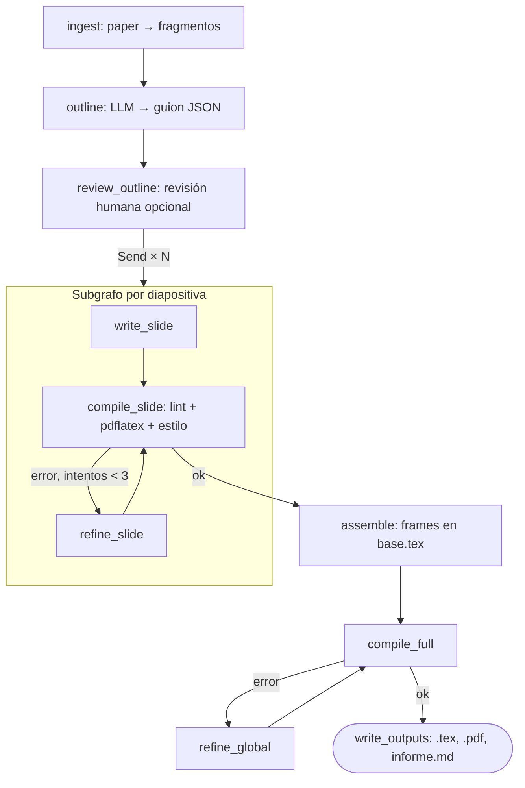

# paper2beamer

Genera presentaciones LaTeX Beamer a partir de papers científicos con un pipeline
de LangGraph. El modelo escribe **una diapositiva a la vez**, cada una se compila y
valida por separado, y solo las que pasan se ensamblan en tu plantilla.



## Estructura

```
├─ beamer_graph.py           # pipeline completo
├─ base.tex                  # TU plantilla: preámbulo, tema, macros, %%SLIDES%%
├─ estilo.toml               # TUS reglas de estilo: guía + límites medibles
├─ requirements.txt
├─ tests/smoke_test.py       # prueba con LLM simulado (no gasta API)
├─ papers/                   # entradas: .pdf, .tex o .md
├─ presentaciones/           # salidas (las crea el workflow)
├─ ejemplos/lsmear/          # presentación de referencia hecha a mano
├─ CLAUDE.md                 # contexto para trabajar en el repo con Claude
└─ .github/workflows/
   ├─ tests.yml              # smoke test en cada push/PR
   └─ generar.yml            # genera presentaciones y abre un PR
```

## Pasos para dejarlo funcionando

### 1. Local

Requisitos: Python 3.11 o superior (usa `tomllib`) y TeX Live con `beamer`,
`metropolis`, `algorithm2e`, `booktabs` y `tikz`.

```bash
# Debian/Ubuntu
sudo apt-get install texlive-latex-recommended texlive-latex-extra \
  texlive-pictures texlive-science texlive-fonts-recommended
# macOS: MacTeX. Windows: MiKTeX o TeX Live.

python -m venv .venv && source .venv/bin/activate
pip install -r requirements.txt

python tests/smoke_test.py          # debe terminar en "OK"
```

### 2. Primera generación local

```bash
export OPENAI_API_KEY="tu-key"      # Windows: set OPENAI_API_KEY=tu-key
python beamer_graph.py papers/mi_paper.pdf --out salida --review
```

Con `--review` el pipeline se detiene tras el guion, lo guarda en
`salida/outline_borrador.json` y espera a que lo edites y pulses Enter.

### 3. GitHub

1. Sube el contenido del zip a tu repo (rama `main`).
2. **Settings → Secrets and variables → Actions → Secrets**: crea
   `OPENAI_API_KEY` (o `ANTHROPIC_API_KEY` si usas Claude).
3. **Settings → Secrets and variables → Actions → Variables** (opcional):
   - `LLM_PROVIDER`: `openai` (por defecto) o `anthropic`
   - `LLM_MODEL_OUTLINE`: tu modelo más capaz
   - `LLM_MODEL_SLIDES`: uno más rápido y barato
4. **Settings → Actions → General → Workflow permissions**: marca
   *Read and write permissions* y *Allow GitHub Actions to create and approve pull
   requests*. Sin esto `generar.yml` no puede abrir el PR.
5. Comprueba que el workflow `tests` pase en verde.

### 4. Uso diario en GitHub

- Sube un paper a `papers/` en `main` → se ejecuta `generar.yml` → llega un PR
  con `presentaciones/<nombre>/` (`presentacion.tex`, `.pdf`, `outline.json`,
  `informe.md`). El PDF también queda en los artefactos del run.
- O lánzalo a mano: **Actions → generar presentacion → Run workflow** e indica
  la ruta del paper.
- Revisa `informe.md` antes de aprobar: dice qué diapos fallaron, cuántos
  intentos necesitaron y qué cifras conviene verificar.

## Configuración

| Qué | Dónde | Notas |
|---|---|---|
| Proveedor y modelos | variables `LLM_PROVIDER`, `LLM_MODEL_OUTLINE`, `LLM_MODEL_SLIDES` | por defecto OpenAI; los nombres por defecto pueden quedar obsoletos, usa los de tu cuenta |
| Razonamiento del guion | variable `LLM_REASONING_OUTLINE` | `low`, `medium` (por defecto) o `high`; solo OpenAI. `LLM_REASONING_SLIDES` hace lo mismo para las diapos (por defecto, sin razonamiento extra) |
| Revisor de afirmaciones | variables `LLM_MODEL_REVIEW` (por defecto el de diapos) y `LLM_REASONING_REVIEW` (por defecto `low`) | cada diapo que compila se verifica contra sus fragmentos; lo no respaldado se refina y, si persiste, queda en `informe.md` |
| Preámbulo, tema, macros | `base.tex` | debe tener exactamente un `%%SLIDES%%` |
| Título/autores | `<<TITLE>>`, `<<AUTHORS>>`, `<<VENUE>>` en `base.tex` | se rellenan desde el guion; si los escribes a mano se respetan |
| Reglas de estilo | `estilo.toml` | `[guia]` va al prompt; `[limites]` se verifica en código |
| Reintentos, tolerancias, nº de diapos | constantes al inicio de `beamer_graph.py` | `MAX_SLIDE_ATTEMPTS`, `OVERFULL_TOLERANCE_PT`, `N_SLIDES`… |
| Extracción de PDF | `--extractor marker` | mejor con ecuaciones; requiere `pip install marker-pdf` |
| Paralelismo | `--concurrency` | bájalo si chocas con límites de tasa de la API |

Opciones de la CLI: `python beamer_graph.py --help`.

## Cómo funciona (notas de diseño)

1. **La base es tuya y el modelo no la toca.** El modelo solo devuelve un
   `\begin{frame}…\end{frame}`. El lint rechaza `\usepackage`, `\newcommand`,
   `\documentclass`, `\input`, `\write18`. Los paquetes y macros de tu base se
   detectan solos y se le informan al modelo en cada diapo.
2. **Validación al inicio.** Antes de gastar llamadas se comprueba que la base
   tenga el marcador, que sus paquetes existan (`kpsewhich`) y que compile vacía.
3. **Recuperación estructural, no RAG.** El paper se trocea por secciones, y las
   ecuaciones, tablas y algoritmos quedan como fragmentos propios (`eq1`, `tab2`,
   `alg1`). El guion (que sí ve el paper completo) asigna a cada diapo los IDs que
   necesita, y cada diapo recibe solo esos. Es trazable y recupera bien tablas y
   fórmulas, que la búsqueda semántica recupera mal. RAG tendría sentido con
   varios papers o documentos muy largos.
4. **Cada diapo se compila sola**, con la cabecera real de la base, en su propio
   directorio temporal (seguro en paralelo). Los errores quedan localizados y el
   refinado trabaja con un frame pequeño.
5. **Beamer reporta los errores en `\end{frame}`** porque lee el frame como
   argumento; el parser del log añade el token culpable como contexto.
6. **Notación compartida.** Las diapos se escriben en paralelo sin verse entre sí;
   el guion define un glosario que reciben todas para no inventar símbolos distintos.
7. **Estilo en tres capas:** la guía va al guion y a cada diapo; los límites se
   validan en el guion (nº de puntos) y en cada frame; lo visual queda pendiente
   (ver hoja de ruta).
8. **El estilo nunca descarta una diapo que compila.** Si tras los intentos sigue
   incumpliendo estilo, se conserva con aviso. Solo una diapo que no compila se
   reemplaza por un marcador "pendiente de revisión".
9. **Chequeo de cifras.** Avisa si un número de la diapo no aparece en sus
   fragmentos fuente. No bloquea; queda en el informe.
10. **Seguridad al compilar código generado:** `-no-shell-escape`, timeout y
    directorio aislado.
11. **Modelo según el nodo:** el más capaz para el guion (la decisión que más
    pesa), uno rápido para las N diapos y los refinados.
12. **La portada es determinista** (`\titlepage`), sin LLM.

## Limitaciones conocidas

- La extracción con `pymupdf4llm` degrada ecuaciones; para papers con mucha
  matemática usa `--extractor marker` o, si existe, la fuente `.tex` (arXiv).
- La detección de tablas y algoritmos en Markdown es heurística.
- El conteo de palabras del estilo aproxima: ignora comandos y cuenta cada
  fórmula como una palabra.
- El chequeo de cifras puede dar falsos positivos (números formateados distinto
  que en la fuente).
- No usa figuras del paper, solo texto.
- `MemorySaver` no persiste entre ejecuciones: si el proceso se corta, se
  empieza de nuevo.

## Hoja de ruta

- [ ] Revisión visual: renderizar cada página a PNG y pasarla a un modelo
      multimodal con una rúbrica corta (saturación, legibilidad, equilibrio).
- [ ] Figuras: extraer imágenes del PDF como fragmentos `fig*` y permitir
      `\includegraphics`.
- [ ] Persistencia con `SqliteSaver` para reanudar sin repetir llamadas.
- [ ] Trazas con LangSmith.
- [ ] Conjunto de evaluación (5–10 papers): tasa de compilación al primer
      intento, refinados promedio, avisos de cifras.
- [ ] Notas del presentador con `\note{}`.
- [ ] Nodo de coherencia narrativa que lea todos los títulos en orden.
- [x] Revisor LLM de afirmaciones contra la fuente (`review_slide`).
- [ ] Juez LLM para reglas no medibles (títulos que afirman, una idea por diapo).

## Costes y cuentas

- Las suscripciones de chat (ChatGPT, Claude) **no incluyen** la API; la key se
  crea y factura aparte (platform.openai.com o la Claude Console).
- Nunca pongas la key en el código ni en un commit: usa variables de entorno en
  local y *secrets* en GitHub.
- Coste aproximado por presentación: 1 llamada de guion + N diapos + refinados
  (máximo 3 por diapo) + hasta 2 refinados globales. `informe.md` muestra los
  intentos reales.
